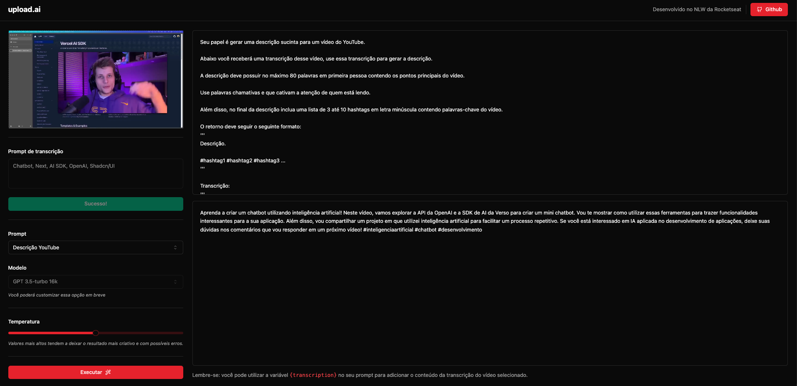

<p align='center'>
  
</p>

<p align="center">
  Aplicação construída no NLW AI da Rocketseat na trilha Mastery.
</p>

<div align="center">
  <a href="https://github.com/welisonw">
    
  </a>
  
  
  <a href="https://github.com/welisonw/nlw13_2023-mastery-upload-ai/blob/main/LICENSE">
      
  </a> 
</div>

<br>

<p align="center">
  <a href="#%EF%B8%8F-sobre-o-projeto">Sobre o Projeto</a>&nbsp;&nbsp;&nbsp;|&nbsp;&nbsp;&nbsp;
  <a href="#%EF%B8%8F-tecnologias-e-ferrementas-utilizadas">Tecnologias e ferramentas</a>&nbsp;&nbsp;&nbsp;|&nbsp;&nbsp;&nbsp;
  <a href="#-instalação-e-utilização">Instalação e utilização</a>&nbsp;&nbsp;&nbsp;|&nbsp;&nbsp;&nbsp;
  <a href="#-licença">Licença</a>
</p>

<br>

<p align="center">
  
</p>

## 🗒️ Sobre o projeto
Desenvolvida na trilha Mastery na edição NLW IA da Rocketseat, a aplicação **upload.ai** permite ao usuário fazer o upload de um vídeo e, por meio da API da OpenAI, criar automaticamente títulos chamativos e descrições com um boa indexação com base no prompt personalizado.

## 🛠️ Tecnologias e ferrementas utilizadas
### Back end (api)
- [TypeScript](https://www.typescriptlang.org/)
- [Node.js](https://nodejs.org/en)
- [Fastify](https://fastify.dev/)
- [Prisma](https://www.prisma.io/)
- [Zod](https://zod.dev/)
- [SQLite](https://www.sqlite.org/index.html)
- [OpenAi](https://www.npmjs.com/package/openai)
- [Vercel AI SDK](https://vercel.com/blog/introducing-the-vercel-ai-sdk)


### Front end (web):
- [TypeScript](https://www.typescriptlang.org/)
- [React](https://react.dev/)
- [Vite](https://vitejs.dev/)
- [TailwindCSS](https://tailwindcss.com/)
- [Axios](https://axios-http.com/)
- [Radix UI](https://www.radix-ui.com/)
- [Shadcn/ui](https://ui.shadcn.com/)
- [Lucide React](https://lucide.dev/guide/packages/lucide-react)
- [FFmpeg](https://ffmpeg.org/)
- [Vercel AI SDK](https://vercel.com/blog/introducing-the-vercel-ai-sdk)

## 💻 Instalação e utilização
Para executar a aplicação em sua máquina localmente, certifique-se de ter o Node.js e um gerenciador de pacotes instalados antes de prosseguir com as etapas abaixo:

> Nesse projeto foi utilizado o [**pnpm**](https://pnpm.io/) como gerenciador de pacotes, que busca economizar espaço em disco e acelerar a instalação de pacotes devido à sua abordagem de armazenamento de dependências compartilhado.

##### Passo 1: Clone este repositório
```bash
$ git clone https://github.com/welisonw/nlw13_2023-mastery-upload-ai.git
```

### Back end (api)
##### Passo 1: Acesse a pasta do projeto
```bash
$ cd nlw13_2023-mastery-upload-ai/api
```

##### Passo 2: Instale as dependências
```bash
# pnpm 
$ pnpm install

# npm
$ npm install

# yarn
$ yarn install
```

##### Passo 3: Crie o arquivo `.env` com as variáveis de ambiente necessárias:
```bash
DATABASE_URL="file:./dev.db"
OPENAI_KEY=*sua OpenAI key*
```
> ⚠️ **Importante**: No campo `DATABASE_URL`, especifique a URL do banco de dados que deseja utilizar. Crie uma conta no site [OpenAI](https://openai.com/), obtenha sua chave da API e preencha-o no campo `OPENAI_KEY`.

##### Passo 4: Gere o client do Prisma
```bash
# pnpm
pnpm prisma generate

# npm
npm prisma generate

# yarn
yarn prisma generate
```

##### Passo 5: Execute as migrations do banco de dados:
```bash
# pnpm
pnpm prisma migrate dev

# npm
npm prisma migrate dev

# yarn
yarn prisma migrate dev
```

##### Passo 6: Inicie o projeto
```bash
# pnpm
pnpm run dev

# npm
npm run dev

# yarn
yarn run dev
```

O servidor estará disponível em http://localhost:3333.

### Front end (web)
##### Passo 1: Acesse a pasta do projeto
```bash
$ cd nlw13_2023-mastery-upload-ai/web
```

##### Passo 2: Instale as dependências
```bash
# pnpm 
$ pnpm install

# npm
$ npm install

# yarn
$ yarn install
```

##### Passo 3: Inicie o projeto
```bash
# pnpm
pnpm run dev

# npm
npm run dev

# yarn
yarn run dev
```

A aplicação estará disponível em http://localhost:5173.

## 📝 Licença
Esse projeto está sob a licença **MIT**. Veja o arquivo [LICENSE](LICENSE) para mais detalhes.
